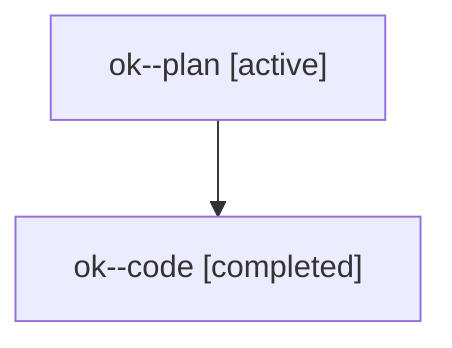

# Family: ok

[Agent Hoods](../README.md) / [bbugyi200](../users/bbugyi200/README.md) / [athena](../users/bbugyi200/machines/athena/README.md) / [ok](../users/bbugyi200/machines/athena/hoods/ok/README.md) / ok

Owner: `bbugyi200.athena` · Hood: `ok` · Members: 2

## Lineage

The diagram is an optional enhancement; the ordered table below contains the same lineage in accessible text.

| Role | Agent | State | Model / provider | Timing | Commits | Prompt | Chat |
|---|---|---|---|---|---:|---|---|
| plan | ok--plan | active | opus / claude | 2026-07-29T19:24:37.742738+00:00 | 0 | [Prompt](../agents/bbugyi200.athena.ok--plan/prompt.md) | [Chat](../agents/bbugyi200.athena.ok--plan/chat.md) |
| code | ok--code | completed | gpt-5.6-sol / codex | 2026-07-29T19:36:45.564386+00:00 | [1](../agents/bbugyi200.athena.ok--code/README.md#commits) | — | [Chat](../agents/bbugyi200.athena.ok--code/chat.md) |

## Commits

| Role | Repo | Commit | Subject | Committed |
|---|---|---|---|---|
| code | sase | [`64ffecf`](https://github.com/sase-org/sase/commit/64ffecf887426a28d64bb635c6b93ddae709a614) | fix(ace): acknowledge unread agents on panel entry | 2026-07-29 19:46:26 UTC |
