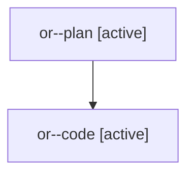

# Family: or

[Agent Hoods](../README.md) / [bbugyi200](../users/bbugyi200/README.md) / [athena](../users/bbugyi200/machines/athena/README.md) / [or](../users/bbugyi200/machines/athena/hoods/or/README.md) / or

Owner: `bbugyi200.athena` · Hood: `or` · Members: 2

## Lineage

The diagram is an optional enhancement; the ordered table below contains the same lineage in accessible text.

| Role | Agent | State | Model / provider | Timing | Commits | Prompt | Chat |
|---|---|---|---|---|---:|---|---|
| plan | or--plan | active | claude-fable-5 / claude | 2026-07-29T20:28:33.556414+00:00 | 0 | [Prompt](../agents/bbugyi200.athena.or--plan/prompt.md) | [Chat](../agents/bbugyi200.athena.or--plan/chat.md) |
| code | or--code | active | gpt-5.6-sol / codex | 2026-07-29T20:44:39.504089+00:00 | [1](../agents/bbugyi200.athena.or--code/README.md#commits) | — | — |

## Commits

| Role | Repo | Commit | Subject | Committed (UTC) |
|---|---|---|---|---|
| code | sase | [`03739dc`](https://github.com/sase-org/sase/commit/03739dcecdc357d73dba1e83c3edce0b4309a58d) | fix(tui): load artifact catalog from target project | 2026-07-29 20:58:36 |
