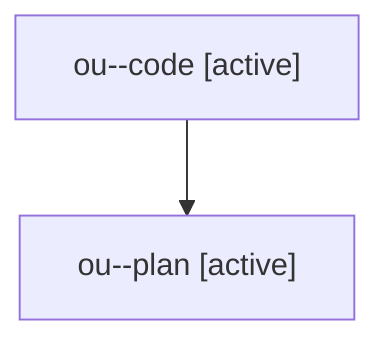

# Family: ou

[Agent Hoods](../README.md) / [bbugyi200](../users/bbugyi200/README.md) / [athena](../users/bbugyi200/machines/athena/README.md) / [ou](../users/bbugyi200/machines/athena/hoods/ou/README.md) / ou

Owner: `bbugyi200.athena` · Hood: `ou` · Members: 2

## Lineage

The diagram is an optional enhancement; the ordered table below contains the same lineage in accessible text.

| Role | Agent | State | Model / provider | Timing | Commits | Prompt | Chat |
|---|---|---|---|---|---:|---|---|
| code | ou--code | active | gpt-5.6-sol / codex | 2026-07-29T20:58:36.225836+00:00 | [1](../agents/bbugyi200.athena.ou--code/README.md#commits) | — | — |
| plan | ou--plan | active | opus / claude | 2026-07-29T20:43:26.398081+00:00 | 0 | [Prompt](../agents/bbugyi200.athena.ou--plan/prompt.md) | [Chat](../agents/bbugyi200.athena.ou--plan/chat.md) |

## Commits

| Role | Commit | Subject | Committed (UTC) |
|---|---|---|---|
| code | [`07aebb2`](https://github.com/sase-org/sase/commit/07aebb2f956550d47051b7d42f41d1642369dfff) | fix(tui): show full prompt input values | 2026-07-29 21:15:07 |
