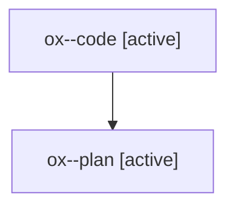

# Family: ox

[Agent Hoods](../README.md) / [bbugyi200](../users/bbugyi200/README.md) / [athena](../users/bbugyi200/machines/athena/README.md) / [ox](../users/bbugyi200/machines/athena/hoods/ox/README.md) / ox

Owner: `bbugyi200.athena` · Hood: `ox` · Members: 2

## Lineage

The diagram is an optional enhancement; the ordered table below contains the same lineage in accessible text.

| Role | Agent | State | Model / provider | Timing | Commits | Prompt | Chat |
|---|---|---|---|---|---:|---|---|
| code | ox--code | active | gpt-5.6-sol / codex | 2026-07-29T22:40:34.010707+00:00 | [1](../agents/bbugyi200.athena.ox--code/README.md#commits) | — | — |
| plan | ox--plan | active | opus / claude | 2026-07-29T22:20:21.138296+00:00 | 0 | [Prompt](../agents/bbugyi200.athena.ox--plan/prompt.md) | [Chat](../agents/bbugyi200.athena.ox--plan/chat.md) |

## Commits

| Role | Commit | Subject | Committed (UTC) |
|---|---|---|---|
| code | [`a79dad1`](https://github.com/sase-org/sase/commit/a79dad1639a7a54406a4c185fdc15be00d8e8628) | feat(ace): allow alt braces before punctuation | 2026-07-29 22:52:38 |
