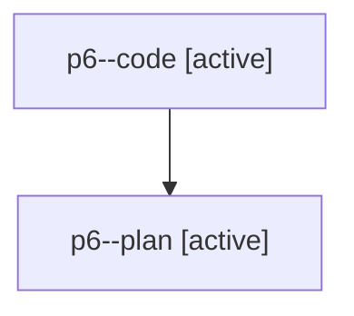

# Family: p6

[Agent Hoods](../README.md) / [bbugyi200](../users/bbugyi200/README.md) / [athena](../users/bbugyi200/machines/athena/README.md) / [p6](../users/bbugyi200/machines/athena/hoods/p6/README.md) / p6

Owner: `bbugyi200.athena` · Hood: `p6` · Members: 2

## Lineage

The diagram is an optional enhancement; the ordered table below contains the same lineage in accessible text.

| Role | Agent | State | Model / provider | Timing | Commits | Prompt | Chat |
|---|---|---|---|---|---:|---|---|
| code | p6--code | active | gpt-5.6-sol / codex | 2026-07-30T10:55:10.515947+00:00 | 0 | — | — |
| plan | p6--plan | active | opus / claude | 2026-07-30T10:35:17.109864+00:00 | 0 | [Prompt](../agents/bbugyi200.athena.p6--plan/prompt.md) | [Chat](../agents/bbugyi200.athena.p6--plan/chat.md) |
