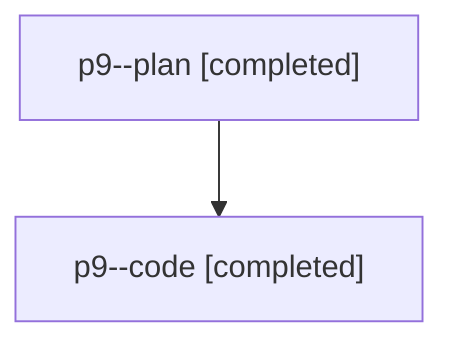

# Family: p9

[Agent Hoods](../README.md) / [bbugyi200](../users/bbugyi200/README.md) / [athena](../users/bbugyi200/machines/athena/README.md) / [p9](../users/bbugyi200/machines/athena/hoods/p9/README.md) / p9

Owner: `bbugyi200.athena` · Hood: `p9` · Members: 2

## Lineage

The diagram is an optional enhancement; the ordered table below contains the same lineage in accessible text.

| Role | Agent | State | Model / provider | Timing | Commits | Prompt | Chat |
|---|---|---|---|---|---:|---|---|
| plan | p9--plan | completed | opus / claude | 2026-07-30T11:04:36.570508+00:00 | 0 | [Prompt](../agents/bbugyi200.athena.p9--plan/prompt.md) | [Chat](../agents/bbugyi200.athena.p9--plan/chat.md) |
| code | p9--code | completed | gpt-5.6-sol / codex | 2026-07-30T11:16:26.691952+00:00 | [1](../agents/bbugyi200.athena.p9--code/README.md#commits) | — | [Chat](../agents/bbugyi200.athena.p9--code/chat.md) |

## Commits

| Role | Commit | Subject | Committed (UTC) |
|---|---|---|---|
| code | [`01ac81a`](https://github.com/sase-org/sase/commit/01ac81a0bd90b28cf38496bbe58bd1e55d7da64e) | fix: resolve clipboard lint and test flake | 2026-07-30 11:31:18 |
