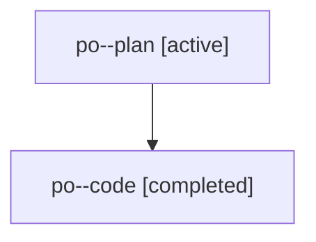

# Family: po

[Agent Hoods](../README.md) / [bbugyi200](../users/bbugyi200/README.md) / [athena](../users/bbugyi200/machines/athena/README.md) / [po](../users/bbugyi200/machines/athena/hoods/po/README.md) / po

Owner: `bbugyi200.athena` · Hood: `po` · Members: 2

## Lineage

The diagram is an optional enhancement; the ordered table below contains the same lineage in accessible text.

| Role | Agent | State | Model / provider | Timing | Commits | Prompt | Chat |
|---|---|---|---|---|---:|---|---|
| plan | po--plan | active | opus / claude | 2026-07-30T19:58:17.096069+00:00 | 0 | [Prompt](../agents/bbugyi200.athena.po--plan/prompt.md) | [Chat](../agents/bbugyi200.athena.po--plan/chat.md) |
| code | po--code | completed | gpt-5.6-sol / codex | 2026-07-30T20:06:11.799867+00:00 | [1](../agents/bbugyi200.athena.po--code/README.md#commits) | — | [Chat](../agents/bbugyi200.athena.po--code/chat.md) |

## Commits

| Role | Repo | Commit | Subject | Committed |
|---|---|---|---|---|
| code | sase | [`e3a898b`](https://github.com/sase-org/sase/commit/e3a898b6a32609979d79ce03d31f6dbf0d7dbc16) | fix(beads): route deferred close pushes correctly | 2026-07-30 16:21:09 EDT |
