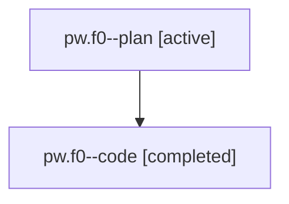

# Family: pw.f0

[Agent Hoods](../README.md) / [bbugyi200](../users/bbugyi200/README.md) / [athena](../users/bbugyi200/machines/athena/README.md) / [pw](../users/bbugyi200/machines/athena/hoods/pw/README.md) / pw.f0

Owner: `bbugyi200.athena` · Hood: `pw` · Members: 2

## Lineage

The diagram is an optional enhancement; the ordered table below contains the same lineage in accessible text.

| Role | Agent | State | Model / provider | Timing | Commits | Prompt | Chat |
|---|---|---|---|---|---:|---|---|
| plan | pw.f0--plan | active | opus / claude | 2026-07-31T11:02:11.859082+00:00 | 0 | [Prompt](../agents/bbugyi200.athena.pw.f0--plan/prompt.md) | [Chat](../agents/bbugyi200.athena.pw.f0--plan/chat.md) |
| code | pw.f0--code | completed | sonnet / claude | 2026-07-31T11:09:17.186233+00:00 | [1](../agents/bbugyi200.athena.pw.f0--code/README.md#commits) | — | [Chat](../agents/bbugyi200.athena.pw.f0--code/chat.md) |

## Commits

| Role | Repo | Commit | Subject | Committed |
|---|---|---|---|---|
| code | sase | [`e5361f4`](https://github.com/sase-org/sase/commit/e5361f4dee7eec736acd8e4f32812f804cb998a1) | feat(llm-provider): hide fakey from model pickers and %model completion | 2026-07-31 11:22:44 UTC |

## Neighbors

| Agent | Relation | State |
|---|---|---|
| [pw](bbugyi200.athena.pw.md) (family · 2) | ancestor | active 1, completed 1 |
