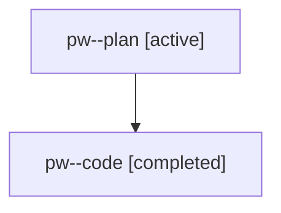

# Family: pw

[Agent Hoods](../README.md) / [bbugyi200](../users/bbugyi200/README.md) / [athena](../users/bbugyi200/machines/athena/README.md) / [pw](../users/bbugyi200/machines/athena/hoods/pw/README.md) / pw

Owner: `bbugyi200.athena` · Hood: `pw` · Members: 2

## Lineage

The diagram is an optional enhancement; the ordered table below contains the same lineage in accessible text.

| Role | Agent | State | Model / provider | Timing | Commits | Prompt | Chat |
|---|---|---|---|---|---:|---|---|
| plan | pw--plan | active | gpt-5.6-sol / codex | 2026-07-31T10:55:48.451780+00:00 | 0 | [Prompt](../agents/bbugyi200.athena.pw--plan/prompt.md) | [Chat](../agents/bbugyi200.athena.pw--plan/chat.md) |
| code | pw--code | completed | gpt-5.3-codex-spark / codex | 2026-07-31T10:59:44.696095+00:00 | [1](../agents/bbugyi200.athena.pw--code/README.md#commits) | — | [Chat](../agents/bbugyi200.athena.pw--code/chat.md) |

## Commits

| Role | Repo | Commit | Subject | Committed |
|---|---|---|---|---|
| code | sase | [`e0d2476`](https://github.com/sase-org/sase/commit/e0d2476f1d3bbe665b52f80858f138c4485494c0) | Update built-in model aliases for Claude and Codex catalog | 2026-07-31 07:01:24 EDT |

## Neighbors

| Agent | Relation | State |
|---|---|---|
| [pw.f0](bbugyi200.athena.pw.f0.md) (family · 2) | descendant | active 1, completed 1 |
