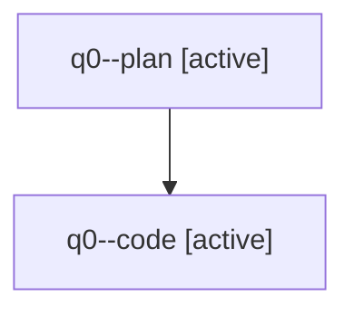

# Family: q0

[Agent Hoods](../README.md) / [bbugyi200](../users/bbugyi200/README.md) / [athena](../users/bbugyi200/machines/athena/README.md) / [q0](../users/bbugyi200/machines/athena/hoods/q0/README.md) / q0

Owner: `bbugyi200.athena` · Hood: `q0` · Members: 2

## Lineage

The diagram is an optional enhancement; the ordered table below contains the same lineage in accessible text.

| Role | Agent | State | Model / provider | Timing | Commits | Prompt | Chat |
|---|---|---|---|---|---:|---|---|
| plan | q0--plan | active | opus / claude | 2026-07-31T11:07:14.760158+00:00 | 0 | [Prompt](../agents/bbugyi200.athena.q0--plan/prompt.md) | [Chat](../agents/bbugyi200.athena.q0--plan/chat.md) |
| code | q0--code | active | sonnet / claude | 2026-07-31T11:24:03.387007+00:00 | [1](../agents/bbugyi200.athena.q0--code/README.md#commits) | — | — |

## Commits

| Role | Repo | Commit | Subject | Committed |
|---|---|---|---|---|
| code | sase | [`1273c78`](https://github.com/sase-org/sase/commit/1273c78a9174a94dd544bf1655826f597a8e52ac) | fix(tui): project plan-family status onto promoted family roots | 2026-07-31 11:48:13 UTC |
