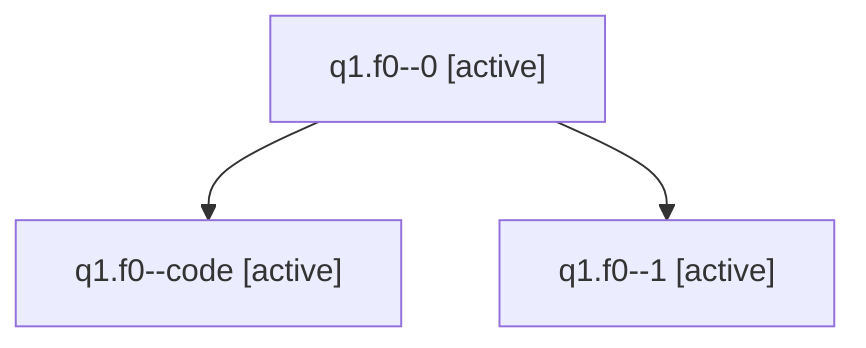

# Family: q1.f0

[Agent Hoods](../README.md) / [bbugyi200](../users/bbugyi200/README.md) / [athena](../users/bbugyi200/machines/athena/README.md) / [q1](../users/bbugyi200/machines/athena/hoods/q1/README.md) / q1.f0

Owner: `bbugyi200.athena` · Hood: `q1` · Members: 3

## Lineage

The diagram is an optional enhancement; the ordered table below contains the same lineage in accessible text.

| Role | Agent | State | Model / provider | Timing | Commits | Prompt | Chat |
|---|---|---|---|---|---:|---|---|
| 0 | q1.f0--0 | active | opus / claude | 2026-07-31T12:24:55.552350+00:00 | 0 | [Prompt](../agents/bbugyi200.athena.q1.f0--0/prompt.md) | [Chat](../agents/bbugyi200.athena.q1.f0--0/chat.md) |
| code | q1.f0--code | active | sonnet / claude | 2026-07-31T12:37:53.985299+00:00 | [1](../agents/bbugyi200.athena.q1.f0--code/README.md#commits) | — | — |
| 1 | q1.f0--1 | active | opus / claude | 2026-07-31T12:30:19.180983+00:00 | 0 | — | [Chat](../agents/bbugyi200.athena.q1.f0--1/chat.md) |

## Commits

| Role | Repo | Commit | Subject | Committed (UTC) |
|---|---|---|---|---|
| code | sase | [`e023e68`](https://github.com/sase-org/sase/commit/e023e68a9d8e363a92e2504e881d92d00f26c39d) | feat(ace-tribes): drop bundled research tribe display config | 2026-07-31 13:01:44 |

## Neighbors

| Agent | Relation | State |
|---|---|---|
| [q1](bbugyi200.athena.q1.md) (family · 2) | ancestor | completed 2 |
