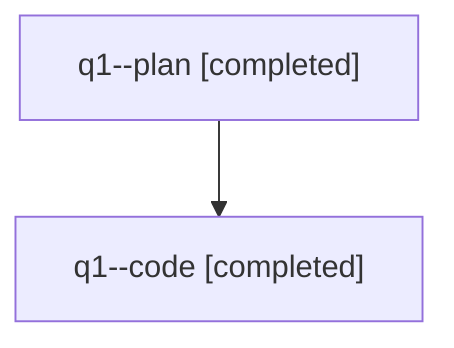

# Family: q1

[Agent Hoods](../README.md) / [bbugyi200](../users/bbugyi200/README.md) / [athena](../users/bbugyi200/machines/athena/README.md) / [q1](../users/bbugyi200/machines/athena/hoods/q1/README.md) / q1

Owner: `bbugyi200.athena` · Hood: `q1` · Members: 2

## Lineage

The diagram is an optional enhancement; the ordered table below contains the same lineage in accessible text.

| Role | Agent | State | Model / provider | Timing | Commits | Prompt | Chat |
|---|---|---|---|---|---:|---|---|
| plan | q1--plan | completed | opus / claude | 2026-07-31T11:13:04.450871+00:00 | 0 | [Prompt](../agents/bbugyi200.athena.q1--plan/prompt.md) | [Chat](../agents/bbugyi200.athena.q1--plan/chat.md) |
| code | q1--code | completed | sonnet / claude | 2026-07-31T11:34:39.539169+00:00 | [1](../agents/bbugyi200.athena.q1--code/README.md#commits) | — | [Chat](../agents/bbugyi200.athena.q1--code/chat.md) |

## Commits

| Role | Repo | Commit | Subject | Committed |
|---|---|---|---|---|
| code | sase | [`ba611aa`](https://github.com/sase-org/sase/commit/ba611aa4834ce85727808aa2738687dae16515a4) | feat(ace-tribes): require a description for configured agent tribes | 2026-07-31 07:59:03 EDT |

## Neighbors

| Agent | Relation | State |
|---|---|---|
| [q1.f0](bbugyi200.athena.q1.f0.md) (family · 3) | descendant | active 3 |
