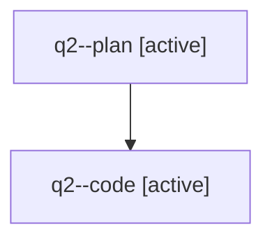

# Family: q2

[Agent Hoods](../README.md) / [bbugyi200](../users/bbugyi200/README.md) / [athena](../users/bbugyi200/machines/athena/README.md) / [q2](../users/bbugyi200/machines/athena/hoods/q2/README.md) / q2

Owner: `bbugyi200.athena` · Hood: `q2` · Members: 2

## Lineage

The diagram is an optional enhancement; the ordered table below contains the same lineage in accessible text.

| Role | Agent | State | Model / provider | Timing | Commits | Prompt | Chat |
|---|---|---|---|---|---:|---|---|
| plan | q2--plan | active | opus / claude | 2026-07-31T11:18:29.379473+00:00 | 0 | [Prompt](../agents/bbugyi200.athena.q2--plan/prompt.md) | [Chat](../agents/bbugyi200.athena.q2--plan/chat.md) |
| code | q2--code | active | sonnet / claude | 2026-07-31T11:34:15.361363+00:00 | [1](../agents/bbugyi200.athena.q2--code/README.md#commits) | — | — |

## Commits

| Role | Repo | Commit | Subject | Committed |
|---|---|---|---|---|
| code | sase | [`0002a05`](https://github.com/sase-org/sase/commit/0002a0590cfe4e2b801a1244046b8311034d4fa1) | feat(ace): add alternate-section jump to Admin Center opener key | 2026-07-31 12:14:47 UTC |
