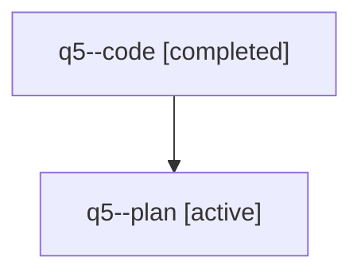

# Family: q5

[Agent Hoods](../README.md) / [bbugyi200](../users/bbugyi200/README.md) / [athena](../users/bbugyi200/machines/athena/README.md) / [q5](../users/bbugyi200/machines/athena/hoods/q5/README.md) / q5

Owner: `bbugyi200.athena` · Hood: `q5` · Members: 2

## Lineage

The diagram is an optional enhancement; the ordered table below contains the same lineage in accessible text.

| Role | Agent | State | Model / provider | Timing | Commits | Prompt | Chat |
|---|---|---|---|---|---:|---|---|
| code | q5--code | completed | sonnet / claude | 2026-07-31T12:25:14.880897+00:00 | [1](../agents/bbugyi200.athena.q5--code/README.md#commits) | — | [Chat](../agents/bbugyi200.athena.q5--code/chat.md) |
| plan | q5--plan | active | opus / claude | 2026-07-31T12:17:06.485277+00:00 | 0 | [Prompt](../agents/bbugyi200.athena.q5--plan/prompt.md) | [Chat](../agents/bbugyi200.athena.q5--plan/chat.md) |

## Commits

| Role | Repo | Commit | Subject | Committed |
|---|---|---|---|---|
| code | sase | [`22e78f7`](https://github.com/sase-org/sase/commit/22e78f792c3a5f251d70cf69a991770be1dcb27c) | fix(bead): derive issue prefixes from PROJECT\_NAME, not ProjectSpec key | 2026-07-31 13:03:50 UTC |
