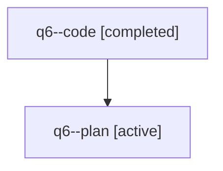

# Family: q6

[Agent Hoods](../README.md) / [bbugyi200](../users/bbugyi200/README.md) / [athena](../users/bbugyi200/machines/athena/README.md) / [q6](../users/bbugyi200/machines/athena/hoods/q6/README.md) / q6

Owner: `bbugyi200.athena` · Hood: `q6` · Members: 2

## Lineage

The diagram is an optional enhancement; the ordered table below contains the same lineage in accessible text.

| Role | Agent | State | Model / provider | Timing | Commits | Prompt | Chat |
|---|---|---|---|---|---:|---|---|
| code | q6--code | completed | sonnet / claude | 2026-07-31T12:30:33.962616+00:00 | [1](../agents/bbugyi200.athena.q6--code/README.md#commits) | — | [Chat](../agents/bbugyi200.athena.q6--code/chat.md) |
| plan | q6--plan | active | opus / claude | 2026-07-31T12:21:18.364814+00:00 | 0 | [Prompt](../agents/bbugyi200.athena.q6--plan/prompt.md) | [Chat](../agents/bbugyi200.athena.q6--plan/chat.md) |

## Commits

| Role | Repo | Commit | Subject | Committed |
|---|---|---|---|---|
| code | sase | [`ae3c010`](https://github.com/sase-org/sase/commit/ae3c0109adf2402e8e8528c9af2ef4dda0438134) | fix(commit): write agent commit messages under .sase/ instead of repo root | 2026-07-31 12:50:16 UTC |
