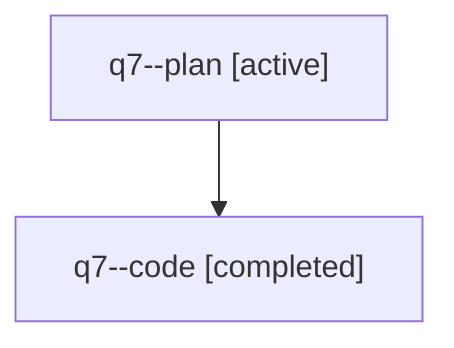

# Family: q7

[Agent Hoods](../README.md) / [bbugyi200](../users/bbugyi200/README.md) / [athena](../users/bbugyi200/machines/athena/README.md) / [q7](../users/bbugyi200/machines/athena/hoods/q7/README.md) / q7

Owner: `bbugyi200.athena` · Hood: `q7` · Members: 2

## Lineage

The diagram is an optional enhancement; the ordered table below contains the same lineage in accessible text.

| Role | Agent | State | Model / provider | Timing | Commits | Prompt | Chat |
|---|---|---|---|---|---:|---|---|
| plan | q7--plan | active | opus / claude | 2026-07-31T12:34:38.181071+00:00 | 0 | [Prompt](../agents/bbugyi200.athena.q7--plan/prompt.md) | [Chat](../agents/bbugyi200.athena.q7--plan/chat.md) |
| code | q7--code | completed | sonnet / claude | 2026-07-31T12:47:38.328849+00:00 | 0 | — | [Chat](../agents/bbugyi200.athena.q7--code/chat.md) |

## Commits

| Role | Repo | Commit | Subject | Committed |
|---|---|---|---|---|
| — | sase | [`146982d`](https://github.com/sase-org/sase/commit/146982d144c3c4c68cba7d65afae5646808dd793) | feat(ace): render tribe description as a labeled block below the header | 2026-07-31 09:44:40 EDT |
