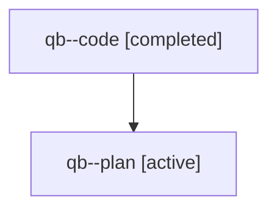

# Family: qb

[Agent Hoods](../README.md) / [bbugyi200](../users/bbugyi200/README.md) / [athena](../users/bbugyi200/machines/athena/README.md) / [qb](../users/bbugyi200/machines/athena/hoods/qb/README.md) / qb

Owner: `bbugyi200.athena` · Hood: `qb` · Members: 2

## Lineage

The diagram is an optional enhancement; the ordered table below contains the same lineage in accessible text.

| Role | Agent | State | Model / provider | Timing | Commits | Prompt | Chat |
|---|---|---|---|---|---:|---|---|
| code | qb--code | completed | sonnet / claude | 2026-07-31T13:17:35.455440+00:00 | [1](../agents/bbugyi200.athena.qb--code/README.md#commits) | — | [Chat](../agents/bbugyi200.athena.qb--code/chat.md) |
| plan | qb--plan | active | opus / claude | 2026-07-31T13:05:46.153280+00:00 | 0 | [Prompt](../agents/bbugyi200.athena.qb--plan/prompt.md) | [Chat](../agents/bbugyi200.athena.qb--plan/chat.md) |

## Commits

| Role | Repo | Commit | Subject | Committed |
|---|---|---|---|---|
| code | sase | [`9d6b40c`](https://github.com/sase-org/sase/commit/9d6b40c6c6e512799414bfc1cba098d2f4959fa5) | feat(sdd): show phase and wave counts in epic clan summary | 2026-07-31 13:52:30 UTC |
