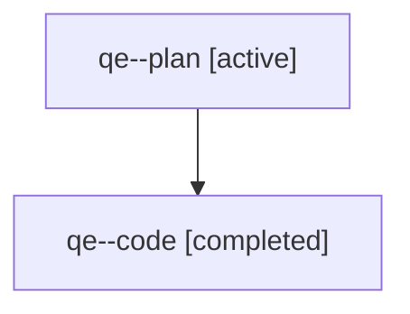

# Family: qe

[Agent Hoods](../README.md) / [bbugyi200](../users/bbugyi200/README.md) / [athena](../users/bbugyi200/machines/athena/README.md) / [qe](../users/bbugyi200/machines/athena/hoods/qe/README.md) / qe

Owner: `bbugyi200.athena` · Hood: `qe` · Members: 2

## Lineage

The diagram is an optional enhancement; the ordered table below contains the same lineage in accessible text.

| Role | Agent | State | Model / provider | Timing | Commits | Prompt | Chat |
|---|---|---|---|---|---:|---|---|
| plan | qe--plan | active | gpt-5.6-sol / codex | 2026-07-31T14:34:49.264314+00:00 | 0 | [Prompt](../agents/bbugyi200.athena.qe--plan/prompt.md) | [Chat](../agents/bbugyi200.athena.qe--plan/chat.md) |
| code | qe--code | completed | gpt-5.3-codex-spark / codex | 2026-07-31T14:38:24.050864+00:00 | [1](../agents/bbugyi200.athena.qe--code/README.md#commits) | — | [Chat](../agents/bbugyi200.athena.qe--code/chat.md) |

## Commits

| Role | Repo | Commit | Subject | Committed |
|---|---|---|---|---|
| code | sase | [`574b776`](https://github.com/sase-org/sase/commit/574b7761fa05e69eafca3956d31f57ed27ae7f5c) | feat(tribe-panel): remove description label in tribe headers | 2026-07-31 10:40:08 EDT |

## Neighbors

| Agent | Relation | State |
|---|---|---|
| [qe.f0](../agents/bbugyi200.athena.qe.f0/README.md) | descendant | active |
