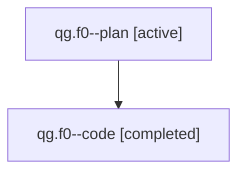

# Family: qg.f0

[Agent Hoods](../README.md) / [bbugyi200](../users/bbugyi200/README.md) / [athena](../users/bbugyi200/machines/athena/README.md) / [qg](../users/bbugyi200/machines/athena/hoods/qg/README.md) / qg.f0

Owner: `bbugyi200.athena` · Hood: `qg` · Members: 2

## Lineage

The diagram is an optional enhancement; the ordered table below contains the same lineage in accessible text.

| Role | Agent | State | Model / provider | Timing | Commits | Prompt | Chat |
|---|---|---|---|---|---:|---|---|
| plan | qg.f0--plan | active | gpt-5.6-sol / codex | 2026-07-31T17:00:21.511712+00:00 | 0 | [Prompt](../agents/bbugyi200.athena.qg.f0--plan/prompt.md) | [Chat](../agents/bbugyi200.athena.qg.f0--plan/chat.md) |
| code | qg.f0--code | completed | gpt-5.5 / codex | 2026-07-31T17:05:12.938369+00:00 | [1](../agents/bbugyi200.athena.qg.f0--code/README.md#commits) | — | [Chat](../agents/bbugyi200.athena.qg.f0--code/chat.md) |

## Commits

| Role | Repo | Commit | Subject | Committed |
|---|---|---|---|---|
| code | sase | [`7d4afb3`](https://github.com/sase-org/sase/commit/7d4afb3948a3236ea393aeaeb46976ba9e458f67) | feat(cli)!: render compact bead rows with glyph-only type cells | 2026-07-31 13:13:49 EDT |

## Neighbors

| Agent | Relation | State |
|---|---|---|
| [qg](bbugyi200.athena.qg.md) (family · 2) | ancestor | active 1, completed 1 |
