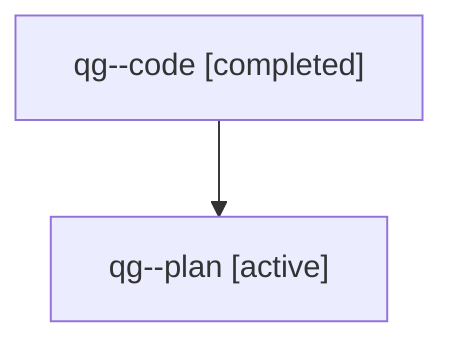

# Family: qg

[Agent Hoods](../README.md) / [bbugyi200](../users/bbugyi200/README.md) / [athena](../users/bbugyi200/machines/athena/README.md) / [qg](../users/bbugyi200/machines/athena/hoods/qg/README.md) / qg

Owner: `bbugyi200.athena` · Hood: `qg` · Members: 2

## Lineage

The diagram is an optional enhancement; the ordered table below contains the same lineage in accessible text.

| Role | Agent | State | Model / provider | Timing | Commits | Prompt | Chat |
|---|---|---|---|---|---:|---|---|
| code | qg--code | completed | sonnet / claude | 2026-07-31T14:54:13.796562+00:00 | [1](../agents/bbugyi200.athena.qg--code/README.md#commits) | — | [Chat](../agents/bbugyi200.athena.qg--code/chat.md) |
| plan | qg--plan | active | opus / claude | 2026-07-31T14:46:31.171199+00:00 | 0 | [Prompt](../agents/bbugyi200.athena.qg--plan/prompt.md) | [Chat](../agents/bbugyi200.athena.qg--plan/chat.md) |

## Commits

| Role | Repo | Commit | Subject | Committed |
|---|---|---|---|---|
| code | sase | [`01ace66`](https://github.com/sase-org/sase/commit/01ace663f411fc6eab8d6bbfbf2f73cb5c3fe2d7) | feat(bead): show type indicator in \`sase bead list\` compact rows | 2026-07-31 11:24:50 EDT |

## Neighbors

| Agent | Relation | State |
|---|---|---|
| [qg.f0](bbugyi200.athena.qg.f0.md) (family · 2) | descendant | active 1, completed 1 |
