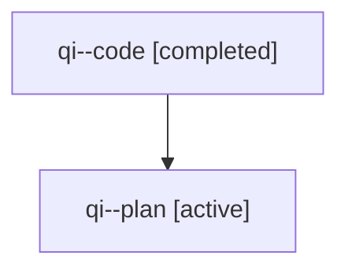

# Family: qi

[Agent Hoods](../README.md) / [bbugyi200](../users/bbugyi200/README.md) / [athena](../users/bbugyi200/machines/athena/README.md) / [qi](../users/bbugyi200/machines/athena/hoods/qi/README.md) / qi

Owner: `bbugyi200.athena` · Hood: `qi` · Members: 2

## Lineage

The diagram is an optional enhancement; the ordered table below contains the same lineage in accessible text.

| Role | Agent | State | Model / provider | Timing | Commits | Prompt | Chat |
|---|---|---|---|---|---:|---|---|
| code | qi--code | completed | gpt-5.5 / codex | 2026-07-31T17:13:57.319813+00:00 | [1](../agents/bbugyi200.athena.qi--code/README.md#commits) | — | [Chat](../agents/bbugyi200.athena.qi--code/chat.md) |
| plan | qi--plan | active | gpt-5.6-sol / codex | 2026-07-31T17:04:55.973228+00:00 | 0 | [Prompt](../agents/bbugyi200.athena.qi--plan/prompt.md) | [Chat](../agents/bbugyi200.athena.qi--plan/chat.md) |

## Commits

| Role | Repo | Commit | Subject | Committed |
|---|---|---|---|---|
| code | sase | [`7765a07`](https://github.com/sase-org/sase/commit/7765a07c915d1bae5469ad2f43072136f4620ae6) | feat(beads): support shorthand bead ids | 2026-07-31 18:02:41 UTC |
