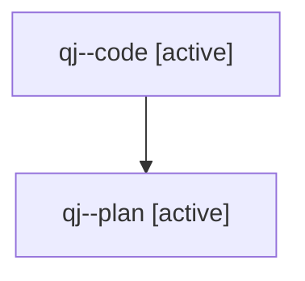

# Family: qj

[Agent Hoods](../README.md) / [bbugyi200](../users/bbugyi200/README.md) / [athena](../users/bbugyi200/machines/athena/README.md) / [qj](../users/bbugyi200/machines/athena/hoods/qj/README.md) / qj

Owner: `bbugyi200.athena` · Hood: `qj` · Members: 2

## Lineage

The diagram is an optional enhancement; the ordered table below contains the same lineage in accessible text.

| Role | Agent | State | Model / provider | Timing | Commits | Prompt | Chat |
|---|---|---|---|---|---:|---|---|
| code | qj--code | active | gpt-5.5 / codex | 2026-07-31T17:15:35.193458+00:00 | [1](../agents/bbugyi200.athena.qj--code/README.md#commits) | — | — |
| plan | qj--plan | active | gpt-5.6-sol / codex | 2026-07-31T17:08:01.027268+00:00 | 0 | [Prompt](../agents/bbugyi200.athena.qj--plan/prompt.md) | [Chat](../agents/bbugyi200.athena.qj--plan/chat.md) |

## Commits

| Role | Repo | Commit | Subject | Committed (UTC) |
|---|---|---|---|---|
| code | sase | [`df5054c`](https://github.com/sase-org/sase/commit/df5054c4073357c29ecf644de8f8ddeb7dc60f58) | feat(notifications): apply mark actions in bulk | 2026-07-31 17:32:41 |
