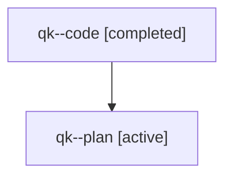

# Family: qk

[Agent Hoods](../README.md) / [bbugyi200](../users/bbugyi200/README.md) / [athena](../users/bbugyi200/machines/athena/README.md) / [qk](../users/bbugyi200/machines/athena/hoods/qk/README.md) / qk

Owner: `bbugyi200.athena` · Hood: `qk` · Members: 2

## Lineage

The diagram is an optional enhancement; the ordered table below contains the same lineage in accessible text.

| Role | Agent | State | Model / provider | Timing | Commits | Prompt | Chat |
|---|---|---|---|---|---:|---|---|
| code | qk--code | completed | gpt-5.5 / codex | 2026-07-31T17:19:22.296364+00:00 | [1](../agents/bbugyi200.athena.qk--code/README.md#commits) | — | [Chat](../agents/bbugyi200.athena.qk--code/chat.md) |
| plan | qk--plan | active | gpt-5.6-sol / codex | 2026-07-31T17:13:13.627780+00:00 | 0 | [Prompt](../agents/bbugyi200.athena.qk--plan/prompt.md) | [Chat](../agents/bbugyi200.athena.qk--plan/chat.md) |

## Commits

| Role | Repo | Commit | Subject | Committed |
|---|---|---|---|---|
| code | sase | [`fe397e3`](https://github.com/sase-org/sase/commit/fe397e3630186dd79d8167f87b6f94e732a79cef) | fix(llm): refresh Antigravity model catalog | 2026-07-31 17:37:06 UTC |
