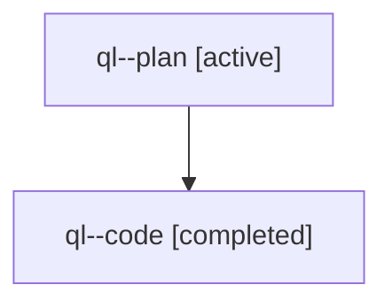

# Family: ql

[Agent Hoods](../README.md) / [bbugyi200](../users/bbugyi200/README.md) / [athena](../users/bbugyi200/machines/athena/README.md) / [ql](../users/bbugyi200/machines/athena/hoods/ql/README.md) / ql

Owner: `bbugyi200.athena` · Hood: `ql` · Members: 2

## Lineage

The diagram is an optional enhancement; the ordered table below contains the same lineage in accessible text.

| Role | Agent | State | Model / provider | Timing | Commits | Prompt | Chat |
|---|---|---|---|---|---:|---|---|
| plan | ql--plan | active | opus / claude | 2026-07-31T17:18:02.005249+00:00 | 0 | [Prompt](../agents/bbugyi200.athena.ql--plan/prompt.md) | [Chat](../agents/bbugyi200.athena.ql--plan/chat.md) |
| code | ql--code | completed | sonnet / claude | 2026-07-31T17:26:25.305437+00:00 | [1](../agents/bbugyi200.athena.ql--code/README.md#commits) | — | [Chat](../agents/bbugyi200.athena.ql--code/chat.md) |

## Commits

| Role | Repo | Commit | Subject | Committed |
|---|---|---|---|---|
| code | sase | [`143666b`](https://github.com/sase-org/sase/commit/143666ba5caee2ee1d9c66c7161f51bbf9e16fe0) | feat(tui): show notification send time in detail pane | 2026-07-31 13:45:31 EDT |
