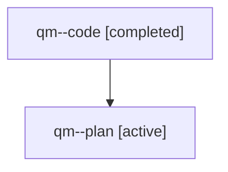

# Family: qm

[Agent Hoods](../README.md) / [bbugyi200](../users/bbugyi200/README.md) / [athena](../users/bbugyi200/machines/athena/README.md) / [qm](../users/bbugyi200/machines/athena/hoods/qm/README.md) / qm

Owner: `bbugyi200.athena` · Hood: `qm` · Members: 2

## Lineage

The diagram is an optional enhancement; the ordered table below contains the same lineage in accessible text.

| Role | Agent | State | Model / provider | Timing | Commits | Prompt | Chat |
|---|---|---|---|---|---:|---|---|
| code | qm--code | completed | sonnet / claude | 2026-07-31T18:44:01.958209+00:00 | [1](../agents/bbugyi200.athena.qm--code/README.md#commits) | — | [Chat](../agents/bbugyi200.athena.qm--code/chat.md) |
| plan | qm--plan | active | opus / claude | 2026-07-31T18:33:20.442525+00:00 | 0 | [Prompt](../agents/bbugyi200.athena.qm--plan/prompt.md) | [Chat](../agents/bbugyi200.athena.qm--plan/chat.md) |

## Commits

| Role | Repo | Commit | Subject | Committed |
|---|---|---|---|---|
| code | sase | [`50988fe`](https://github.com/sase-org/sase/commit/50988fe7f0b77c0f54fbd71fd9de89ae3788662b) | feat(beads): accept multiple bead IDs in \`sase bead update\` | 2026-07-31 19:28:11 UTC |
