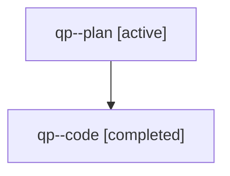

# Family: qp

[Agent Hoods](../README.md) / [bbugyi200](../users/bbugyi200/README.md) / [athena](../users/bbugyi200/machines/athena/README.md) / [qp](../users/bbugyi200/machines/athena/hoods/qp/README.md) / qp

Owner: `bbugyi200.athena` · Hood: `qp` · Members: 2

## Lineage

The diagram is an optional enhancement; the ordered table below contains the same lineage in accessible text.

| Role | Agent | State | Model / provider | Timing | Commits | Prompt | Chat |
|---|---|---|---|---|---:|---|---|
| plan | qp--plan | active | opus / claude | 2026-07-31T19:28:46.597042+00:00 | 0 | [Prompt](../agents/bbugyi200.athena.qp--plan/prompt.md) | [Chat](../agents/bbugyi200.athena.qp--plan/chat.md) |
| code | qp--code | completed | sonnet / claude | 2026-07-31T19:48:34.999711+00:00 | [1](../agents/bbugyi200.athena.qp--code/README.md#commits) | — | [Chat](../agents/bbugyi200.athena.qp--code/chat.md) |

## Commits

| Role | Repo | Commit | Subject | Committed |
|---|---|---|---|---|
| code | sase | [`6e96dea`](https://github.com/sase-org/sase/commit/6e96deaf8fdb94af4e3080a92882f0394d4ded55) | fix(beads): stop approved epic archives from dropping their PROMPT link | 2026-07-31 16:05:21 EDT |
