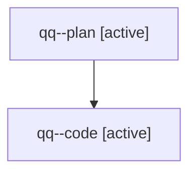

# Family: qq

[Agent Hoods](../README.md) / [bbugyi200](../users/bbugyi200/README.md) / [athena](../users/bbugyi200/machines/athena/README.md) / [qq](../users/bbugyi200/machines/athena/hoods/qq/README.md) / qq

Owner: `bbugyi200.athena` · Hood: `qq` · Members: 2

## Lineage

The diagram is an optional enhancement; the ordered table below contains the same lineage in accessible text.

| Role | Agent | State | Model / provider | Timing | Commits | Prompt | Chat |
|---|---|---|---|---|---:|---|---|
| plan | qq--plan | active | opus / claude | 2026-07-31T20:01:10.283266+00:00 | 0 | [Prompt](../agents/bbugyi200.athena.qq--plan/prompt.md) | [Chat](../agents/bbugyi200.athena.qq--plan/chat.md) |
| code | qq--code | active | sonnet / claude | 2026-07-31T20:08:06.824587+00:00 | [1](../agents/bbugyi200.athena.qq--code/README.md#commits) | — | — |

## Commits

| Role | Repo | Commit | Subject | Committed (UTC) |
|---|---|---|---|---|
| code | sase | [`f55ce07`](https://github.com/sase-org/sase/commit/f55ce07d164d57b1c05d6585b191459adcc9e5e7) | feat(llm\_provider): drive shipped model alias defaults from one YAML file | 2026-07-31 20:27:52 |
