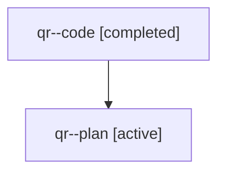

# Family: qr

[Agent Hoods](../README.md) / [bbugyi200](../users/bbugyi200/README.md) / [athena](../users/bbugyi200/machines/athena/README.md) / [qr](../users/bbugyi200/machines/athena/hoods/qr/README.md) / qr

Owner: `bbugyi200.athena` · Hood: `qr` · Members: 2

## Lineage

The diagram is an optional enhancement; the ordered table below contains the same lineage in accessible text.

| Role | Agent | State | Model / provider | Timing | Commits | Prompt | Chat |
|---|---|---|---|---|---:|---|---|
| code | qr--code | completed | sonnet / claude | 2026-07-31T21:47:52.452946+00:00 | [1](../agents/bbugyi200.athena.qr--code/README.md#commits) | — | [Chat](../agents/bbugyi200.athena.qr--code/chat.md) |
| plan | qr--plan | active | opus / claude | 2026-07-31T21:32:11.253314+00:00 | 0 | [Prompt](../agents/bbugyi200.athena.qr--plan/prompt.md) | [Chat](../agents/bbugyi200.athena.qr--plan/chat.md) |

## Commits

| Role | Repo | Commit | Subject | Committed |
|---|---|---|---|---|
| code | sase | [`f0e1a25`](https://github.com/sase-org/sase/commit/f0e1a25e6ee5be14ba7e94439610d64e261d2500) | fix(memory): scope generated bead memory note to project repos only | 2026-07-31 22:21:56 UTC |
