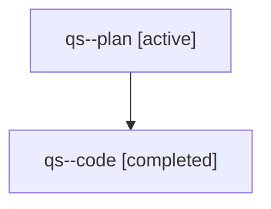

# Family: qs

[Agent Hoods](../README.md) / [bbugyi200](../users/bbugyi200/README.md) / [athena](../users/bbugyi200/machines/athena/README.md) / [qs](../users/bbugyi200/machines/athena/hoods/qs/README.md) / qs

Owner: `bbugyi200.athena` · Hood: `qs` · Members: 2

## Lineage

The diagram is an optional enhancement; the ordered table below contains the same lineage in accessible text.

| Role | Agent | State | Model / provider | Timing | Commits | Prompt | Chat |
|---|---|---|---|---|---:|---|---|
| plan | qs--plan | active | opus / claude | 2026-07-31T20:27:33.498376+00:00 | 0 | [Prompt](../agents/bbugyi200.athena.qs--plan/prompt.md) | [Chat](../agents/bbugyi200.athena.qs--plan/chat.md) |
| code | qs--code | completed | sonnet / claude | 2026-07-31T20:36:36.116497+00:00 | [1](../agents/bbugyi200.athena.qs--code/README.md#commits) | — | [Chat](../agents/bbugyi200.athena.qs--code/chat.md) |

## Commits

| Role | Repo | Commit | Subject | Committed |
|---|---|---|---|---|
| code | sase | [`fcaf211`](https://github.com/sase-org/sase/commit/fcaf211326a42faf7337996c4cc3d621afb617a5) | fix(axe): normalize handoff interruptions structurally, not by provider error text | 2026-07-31 20:45:24 UTC |
