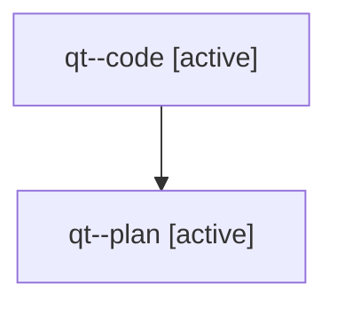

# Family: qt

[Agent Hoods](../README.md) / [bbugyi200](../users/bbugyi200/README.md) / [athena](../users/bbugyi200/machines/athena/README.md) / [qt](../users/bbugyi200/machines/athena/hoods/qt/README.md) / qt

Owner: `bbugyi200.athena` · Hood: `qt` · Members: 2

## Lineage

The diagram is an optional enhancement; the ordered table below contains the same lineage in accessible text.

| Role | Agent | State | Model / provider | Timing | Commits | Prompt | Chat |
|---|---|---|---|---|---:|---|---|
| code | qt--code | active | sonnet / claude | 2026-07-31T22:05:07.546878+00:00 | 0 | — | — |
| plan | qt--plan | active | opus / claude | 2026-07-31T21:36:04.870212+00:00 | 0 | [Prompt](../agents/bbugyi200.athena.qt--plan/prompt.md) | [Chat](../agents/bbugyi200.athena.qt--plan/chat.md) |
