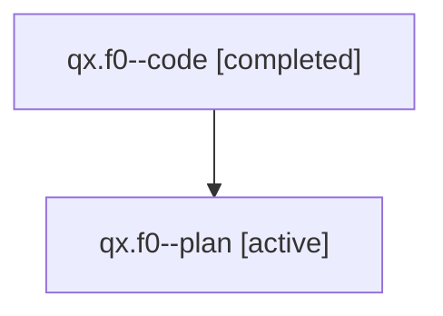

# Family: qx.f0

[Agent Hoods](../README.md) / [bbugyi200](../users/bbugyi200/README.md) / [athena](../users/bbugyi200/machines/athena/README.md) / [qx](../users/bbugyi200/machines/athena/hoods/qx/README.md) / qx.f0

Owner: `bbugyi200.athena` · Hood: `qx` · Members: 2

## Lineage

The diagram is an optional enhancement; the ordered table below contains the same lineage in accessible text.

| Role | Agent | State | Model / provider | Timing | Commits | Prompt | Chat |
|---|---|---|---|---|---:|---|---|
| code | qx.f0--code | completed | sonnet / claude | 2026-08-01T11:57:13.660564+00:00 | [1](../agents/bbugyi200.athena.qx.f0--code/README.md#commits) | — | [Chat](../agents/bbugyi200.athena.qx.f0--code/chat.md) |
| plan | qx.f0--plan | active | opus / claude | 2026-08-01T07:48:38.409286 | 0 | [Prompt](../agents/bbugyi200.athena.qx.f0--plan/prompt.md) | [Chat](../agents/bbugyi200.athena.qx.f0--plan/chat.md) |

## Commits

| Role | Repo | Commit | Subject | Committed |
|---|---|---|---|---|
| code | sase | [`0f273b6`](https://github.com/sase-org/sase/commit/0f273b6083eca865bc23b6064fb37ef3d88502fa) | feat(ace): add word to aspell personal dictionary from spellcheck panel | 2026-08-01 12:27:58 UTC |

## Neighbors

| Agent | Relation | State |
|---|---|---|
| [qx](bbugyi200.athena.qx.md) (family · 2) | ancestor | active 1, completed 1 |
