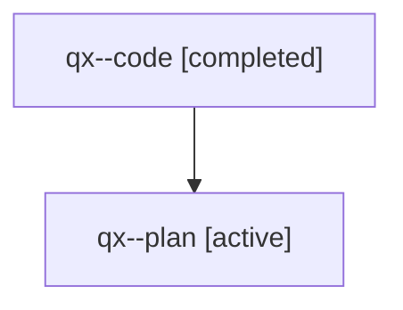

# Family: qx

[Agent Hoods](../README.md) / [bbugyi200](../users/bbugyi200/README.md) / [athena](../users/bbugyi200/machines/athena/README.md) / [qx](../users/bbugyi200/machines/athena/hoods/qx/README.md) / qx

Owner: `bbugyi200.athena` · Hood: `qx` · Members: 2

## Lineage

The diagram is an optional enhancement; the ordered table below contains the same lineage in accessible text.

| Role | Agent | State | Model / provider | Timing | Commits | Prompt | Chat |
|---|---|---|---|---|---:|---|---|
| code | qx--code | completed | sonnet / claude | 2026-08-01T11:04:49.576513+00:00 | [1](../agents/bbugyi200.athena.qx--code/README.md#commits) | — | [Chat](../agents/bbugyi200.athena.qx--code/chat.md) |
| plan | qx--plan | active | opus / claude | 2026-08-01T06:56:21.203781 | 0 | [Prompt](../agents/bbugyi200.athena.qx--plan/prompt.md) | [Chat](../agents/bbugyi200.athena.qx--plan/chat.md) |

## Commits

| Role | Repo | Commit | Subject | Committed |
|---|---|---|---|---|
| code | sase | [`e2d56df`](https://github.com/sase-org/sase/commit/e2d56dfce25e5add6a2d1630be04588f4ceed568) | feat(ace): remember misspelled words and squiggle them in every prompt | 2026-08-01 11:46:08 UTC |

## Neighbors

| Agent | Relation | State |
|---|---|---|
| [qx.f0](bbugyi200.athena.qx.f0.md) (family · 2) | descendant | active 1, completed 1 |
