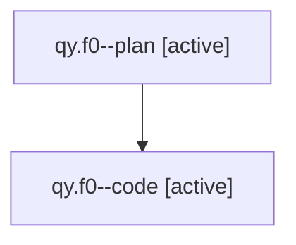

# Family: qy.f0

[Agent Hoods](../README.md) / [bbugyi200](../users/bbugyi200/README.md) / [athena](../users/bbugyi200/machines/athena/README.md) / [qy](../users/bbugyi200/machines/athena/hoods/qy/README.md) / qy.f0

Owner: `bbugyi200.athena` · Hood: `qy` · Members: 2

## Lineage

The diagram is an optional enhancement; the ordered table below contains the same lineage in accessible text.

| Role | Agent | State | Model / provider | Timing | Commits | Prompt | Chat |
|---|---|---|---|---|---:|---|---|
| plan | qy.f0--plan | active | opus / claude | 2026-08-01T08:47:23.874635 | 0 | [Prompt](../agents/bbugyi200.athena.qy.f0--plan/prompt.md) | [Chat](../agents/bbugyi200.athena.qy.f0--plan/chat.md) |
| code | qy.f0--code | active | sonnet / claude | 2026-08-01T13:10:14.543961+00:00 | 0 | — | — |

## Neighbors

| Agent | Relation | State |
|---|---|---|
| [qy](bbugyi200.athena.qy.md) (family · 2) | ancestor | active 1, completed 1 |
