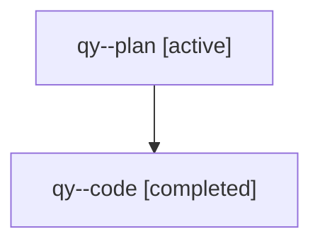

# Family: qy

[Agent Hoods](../README.md) / [bbugyi200](../users/bbugyi200/README.md) / [athena](../users/bbugyi200/machines/athena/README.md) / [qy](../users/bbugyi200/machines/athena/hoods/qy/README.md) / qy

Owner: `bbugyi200.athena` · Hood: `qy` · Members: 2

## Lineage

The diagram is an optional enhancement; the ordered table below contains the same lineage in accessible text.

| Role | Agent | State | Model / provider | Timing | Commits | Prompt | Chat |
|---|---|---|---|---|---:|---|---|
| plan | qy--plan | active | gpt-5.6-sol / codex | 2026-08-01T07:08:37.824445 | 0 | [Prompt](../agents/bbugyi200.athena.qy--plan/prompt.md) | [Chat](../agents/bbugyi200.athena.qy--plan/chat.md) |
| code | qy--code | completed | gpt-5.5 / codex | 2026-08-01T11:18:11.263616+00:00 | [1](../agents/bbugyi200.athena.qy--code/README.md#commits) | — | [Chat](../agents/bbugyi200.athena.qy--code/chat.md) |

## Commits

| Role | Repo | Commit | Subject | Committed |
|---|---|---|---|---|
| code | sase | [`460b8ff`](https://github.com/sase-org/sase/commit/460b8ff2356cc7f35357d2207b14f23182eef3c9) | feat(ace): remember admin center entry selections | 2026-08-01 08:01:39 EDT |

## Neighbors

| Agent | Relation | State |
|---|---|---|
| [qy.f0](bbugyi200.athena.qy.f0.md) (family · 2) | descendant | active 2 |
