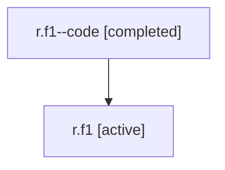

# Family: r.f1

Owner: `bbugyi200.athena` · Hood: `r` · Members: 2

## Lineage

The diagram is an optional enhancement; the ordered table below contains the same lineage in accessible text.

| Role | Agent | State | Model / provider | Timing | Commits | Prompt | Chat |
|---|---|---|---|---|---:|---|---|
| code | r.f1--code | completed | gpt-5.5 / codex | 2026-07-06T22:12:54.197553+00:00 | 0 | — | [Chat](../agents/bbugyi200.athena.r.f1--code/chat.md) |
| root | r.f1 | active | claude-fable-5 / claude | 2026-07-06T21:42:39.723111+00:00 | 3 | [Prompt](../agents/bbugyi200.athena.r.f1/prompt.md) | [Chat](../agents/bbugyi200.athena.r.f1/chat.md) |
