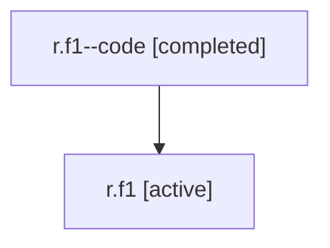

# Family: r.f1

[Agent Hoods](../README.md) / [bbugyi200](../users/bbugyi200/README.md) / [athena](../users/bbugyi200/machines/athena/README.md) / [r](../users/bbugyi200/machines/athena/hoods/r/README.md) / r.f1

Owner: `bbugyi200.athena` · Hood: `r` · Members: 2

## Lineage

The diagram is an optional enhancement; the ordered table below contains the same lineage in accessible text.

| Role | Agent | State | Model / provider | Timing | Commits | Prompt | Chat |
|---|---|---|---|---|---:|---|---|
| code | r.f1--code | completed | gpt-5.5 / codex | 2026-07-06T22:12:54.197553+00:00 | [1](../agents/bbugyi200.athena.r.f1--code/README.md#commits) | — | [Chat](../agents/bbugyi200.athena.r.f1--code/chat.md) |
| root | r.f1 | active | claude-fable-5 / claude | 2026-07-06T21:42:39.723111+00:00 | [3](../agents/bbugyi200.athena.r.f1/README.md#commits) | [Prompt](../agents/bbugyi200.athena.r.f1/prompt.md) | [Chat](../agents/bbugyi200.athena.r.f1/chat.md) |

## Commits

| Role | Repo | Commit | Subject | Committed |
|---|---|---|---|---|
| root | sase | [`80eb745`](https://github.com/sase-org/sase/commit/80eb745fd24d9ce1c2f8a1cfd68db0f6e8810f49) | chore: Add SDD prompt and plan for chezmoi\_model\_aliases\_migration | 2026-07-03 17:08:53 UTC |
| root | sase | [`00c6cc4`](https://github.com/sase-org/sase/commit/00c6cc4b0ea5262ca8c0d092a3cc6084e231fe8c) | chore: Add SDD prompt and plan for linked\_repo\_sibling\_state\_root\_cause | 2026-07-06 22:12:52 UTC |
| code | sase | [`c3de387`](https://github.com/sase-org/sase/commit/c3de3870ef61231e4ca2b3dd90075f63ad860b34) | fix: materialize linked repos as sibling projects | 2026-07-06 22:24:42 UTC |
| root | sase | [`c3de387`](https://github.com/sase-org/sase/commit/c3de3870ef61231e4ca2b3dd90075f63ad860b34) | fix: materialize linked repos as sibling projects | 2026-07-06 22:24:42 UTC |

## Neighbors

| Agent | Relation | State |
|---|---|---|
| [r](bbugyi200.athena.r.md) (family · 2) | ancestor | active 1, completed 1 |
