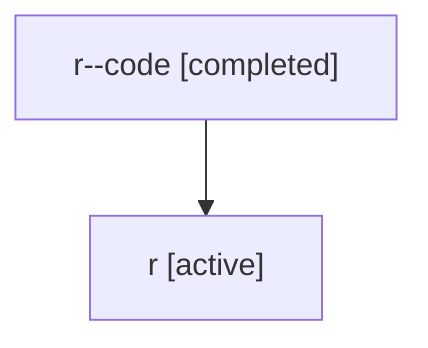

# Family: r

Owner: `bbugyi200.athena` · Hood: `r` · Members: 2

## Lineage

The diagram is an optional enhancement; the ordered table below contains the same lineage in accessible text.

| Role | Agent | State | Model / provider | Timing | Commits | Prompt | Chat |
|---|---|---|---|---|---:|---|---|
| code | r--code | completed | gpt-5.5 / codex | 2026-07-06T21:29:38.277369+00:00 | 0 | — | [Chat](../agents/bbugyi200.athena.r--code/chat.md) |
| root | r | active | claude-fable-5 / claude | 2026-07-06T21:16:51.807315+00:00 | 4 | [Prompt](../agents/bbugyi200.athena.r/prompt.md) | [Chat](../agents/bbugyi200.athena.r/chat.md) |
