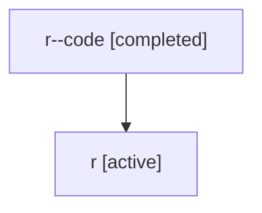

# Family: r

[Agent Hoods](../README.md) / [bbugyi200](../users/bbugyi200/README.md) / [athena](../users/bbugyi200/machines/athena/README.md) / [r](../users/bbugyi200/machines/athena/hoods/r/README.md) / r

Owner: `bbugyi200.athena` · Hood: `r` · Members: 2

## Lineage

The diagram is an optional enhancement; the ordered table below contains the same lineage in accessible text.

| Role | Agent | State | Model / provider | Timing | Commits | Prompt | Chat |
|---|---|---|---|---|---:|---|---|
| code | r--code | completed | gpt-5.5 / codex | 2026-07-06T21:29:38.277369+00:00 | 0 | — | [Chat](../agents/bbugyi200.athena.r--code/chat.md) |
| root | r | active | claude-fable-5 / claude | 2026-07-06T21:16:51.807315+00:00 | [4](../agents/bbugyi200.athena.r/README.md#commits) | [Prompt](../agents/bbugyi200.athena.r/prompt.md) | [Chat](../agents/bbugyi200.athena.r/chat.md) |

## Commits

| Role | Repo | Commit | Subject | Committed |
|---|---|---|---|---|
| root | sase | [`e814e52`](https://github.com/sase-org/sase/commit/e814e52c4c6803cfcfd66cf23f60515bf2038d8c) | chore: Add SDD prompt and plan for unified\_model\_aliases | 2026-07-03 11:46:37 EDT |
| root | sase | [`8b0ff2c`](https://github.com/sase-org/sase/commit/8b0ff2c9fc2bd6a3eb95e16aa2ad2bbe8f2999d0) | feat!: unify model alias config | 2026-07-03 12:19:52 EDT |
| root | sase | [`2d0aef2`](https://github.com/sase-org/sase/commit/2d0aef25ee83307e1660397a72beae9fa507a649) | chore: Add SDD prompt and plan for linked\_repo\_finalizer\_blindness | 2026-07-06 17:29:37 EDT |
| root | sase | [`7bd3c07`](https://github.com/sase-org/sase/commit/7bd3c07bbce8011b5ae24ea2d04ad2c2a18e88a1) | fix: catch dirty linked repos without open markers | 2026-07-06 17:42:17 EDT |

## Neighbors

| Agent | Relation | State |
|---|---|---|
| [r.f1](bbugyi200.athena.r.f1.md) (family · 2) | descendant | active 1, completed 1 |
