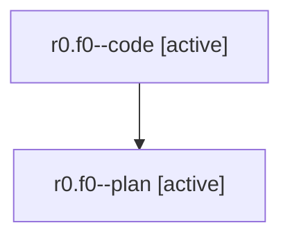

# Family: r0.f0

[Agent Hoods](../README.md) / [bbugyi200](../users/bbugyi200/README.md) / [athena](../users/bbugyi200/machines/athena/README.md) / [r0](../users/bbugyi200/machines/athena/hoods/r0/README.md) / r0.f0

Owner: `bbugyi200.athena` · Hood: `r0` · Members: 2

## Lineage

The diagram is an optional enhancement; the ordered table below contains the same lineage in accessible text.

| Role | Agent | State | Model / provider | Timing | Commits | Prompt | Chat |
|---|---|---|---|---|---:|---|---|
| code | r0.f0--code | active | gpt-5.5 / codex | 2026-08-01T12:26:59.206172+00:00 | [1](../agents/bbugyi200.athena.r0.f0--code/README.md#commits) | — | — |
| plan | r0.f0--plan | active | gpt-5.6-sol / codex | 2026-08-01T12:24:14.069202+00:00 | 0 | [Prompt](../agents/bbugyi200.athena.r0.f0--plan/prompt.md) | [Chat](../agents/bbugyi200.athena.r0.f0--plan/chat.md) |

## Commits

| Role | Repo | Commit | Subject | Committed |
|---|---|---|---|---|
| code | sase | [`5022003`](https://github.com/sase-org/sase/commit/502200368dd7d2f4762ee8bb5d8fd18b33e2ae88) | fix(beads): use default priority for task workers | 2026-08-01 08:58:16 EDT |

## Neighbors

| Agent | Relation | State |
|---|---|---|
| [r0](bbugyi200.athena.r0.md) (family · 2) | ancestor | completed 2 |
