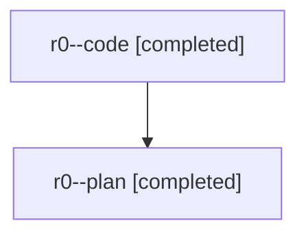

# Family: r0

[Agent Hoods](../README.md) / [bbugyi200](../users/bbugyi200/README.md) / [athena](../users/bbugyi200/machines/athena/README.md) / [r0](../users/bbugyi200/machines/athena/hoods/r0/README.md) / r0

Owner: `bbugyi200.athena` · Hood: `r0` · Members: 2

## Lineage

The diagram is an optional enhancement; the ordered table below contains the same lineage in accessible text.

| Role | Agent | State | Model / provider | Timing | Commits | Prompt | Chat |
|---|---|---|---|---|---:|---|---|
| code | r0--code | completed | gpt-5.5 / codex | 2026-08-01T12:05:27.544919+00:00 | [1](../agents/bbugyi200.athena.r0--code/README.md#commits) | — | [Chat](../agents/bbugyi200.athena.r0--code/chat.md) |
| plan | r0--plan | completed | gpt-5.6-sol / codex | 2026-08-01T12:01:16.661457+00:00 | 0 | [Prompt](../agents/bbugyi200.athena.r0--plan/prompt.md) | [Chat](../agents/bbugyi200.athena.r0--plan/chat.md) |

## Commits

| Role | Repo | Commit | Subject | Committed |
|---|---|---|---|---|
| code | sase | [`8b6f8fd`](https://github.com/sase-org/sase/commit/8b6f8fdfe2d3019706f416da0fe886f78b1e7ad4) | fix: keep epic bead agents at default priority | 2026-08-01 08:18:17 EDT |

## Neighbors

| Agent | Relation | State |
|---|---|---|
| [r0.f0](bbugyi200.athena.r0.f0.md) (family · 2) | descendant | active 2 |
