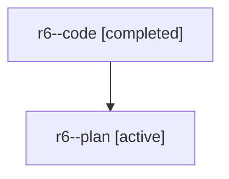

# Family: r6

[Agent Hoods](../README.md) / [bbugyi200](../users/bbugyi200/README.md) / [athena](../users/bbugyi200/machines/athena/README.md) / [r6](../users/bbugyi200/machines/athena/hoods/r6/README.md) / r6

Owner: `bbugyi200.athena` · Hood: `r6` · Members: 2

## Lineage

The diagram is an optional enhancement; the ordered table below contains the same lineage in accessible text.

| Role | Agent | State | Model / provider | Timing | Commits | Prompt | Chat |
|---|---|---|---|---|---:|---|---|
| code | r6--code | completed | sonnet / claude | 2026-08-01T13:04:13.272327+00:00 | [1](../agents/bbugyi200.athena.r6--code/README.md#commits) | — | [Chat](../agents/bbugyi200.athena.r6--code/chat.md) |
| plan | r6--plan | active | opus / claude | 2026-08-01T12:54:45.022123+00:00 | 0 | [Prompt](../agents/bbugyi200.athena.r6--plan/prompt.md) | [Chat](../agents/bbugyi200.athena.r6--plan/chat.md) |

## Commits

| Role | Repo | Commit | Subject | Committed |
|---|---|---|---|---|
| code | sase | [`6e8029b`](https://github.com/sase-org/sase/commit/6e8029b7b460bf1c38e857bc0f605b0381a6f2cb) | feat(bead): colorize and syntax-highlight \`sase bead show\` | 2026-08-01 13:48:41 UTC |
