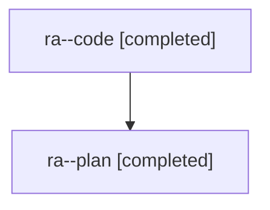

# Family: ra

[Agent Hoods](../README.md) / [bbugyi200](../users/bbugyi200/README.md) / [athena](../users/bbugyi200/machines/athena/README.md) / [ra](../users/bbugyi200/machines/athena/hoods/ra/README.md) / ra

Owner: `bbugyi200.athena` · Hood: `ra` · Members: 2

## Lineage

The diagram is an optional enhancement; the ordered table below contains the same lineage in accessible text.

| Role | Agent | State | Model / provider | Timing | Commits | Prompt | Chat |
|---|---|---|---|---|---:|---|---|
| code | ra--code | completed | gpt-5.5 / codex | 2026-08-01T14:01:51.688288+00:00 | [1](../agents/bbugyi200.athena.ra--code/README.md#commits) | — | [Chat](../agents/bbugyi200.athena.ra--code/chat.md) |
| plan | ra--plan | completed | gpt-5.6-sol / codex | 2026-08-01T13:51:52.790759+00:00 | 0 | [Prompt](../agents/bbugyi200.athena.ra--plan/prompt.md) | [Chat](../agents/bbugyi200.athena.ra--plan/chat.md) |

## Commits

| Role | Repo | Commit | Subject | Committed (UTC) |
|---|---|---|---|---|
| code | sase | [`d2d8151`](https://github.com/sase-org/sase/commit/d2d8151165ac64ca67e1a4c44fe9feb1cf648ecf) | fix: dedupe notification toasts by activity cursor | 2026-08-01 14:15:57 |
