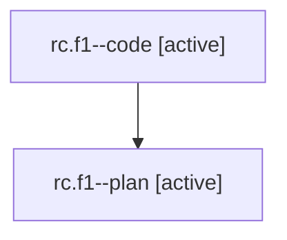

# Family: rc.f1

[Agent Hoods](../README.md) / [bbugyi200](../users/bbugyi200/README.md) / [athena](../users/bbugyi200/machines/athena/README.md) / [rc](../users/bbugyi200/machines/athena/hoods/rc/README.md) / rc.f1

Owner: `bbugyi200.athena` · Hood: `rc` · Members: 2

## Lineage

The diagram is an optional enhancement; the ordered table below contains the same lineage in accessible text.

| Role | Agent | State | Model / provider | Timing | Commits | Prompt | Chat |
|---|---|---|---|---|---:|---|---|
| code | rc.f1--code | active | gpt-5.5 / codex | 2026-08-01T14:39:28.653626+00:00 | 0 | — | — |
| plan | rc.f1--plan | active | gpt-5.6-sol / codex | 2026-08-01T14:34:42.751941+00:00 | 0 | [Prompt](../agents/bbugyi200.athena.rc.f1--plan/prompt.md) | [Chat](../agents/bbugyi200.athena.rc.f1--plan/chat.md) |

## Neighbors

| Agent | Relation | State |
|---|---|---|
| [rc](../agents/bbugyi200.athena.rc/README.md) | ancestor | completed |
