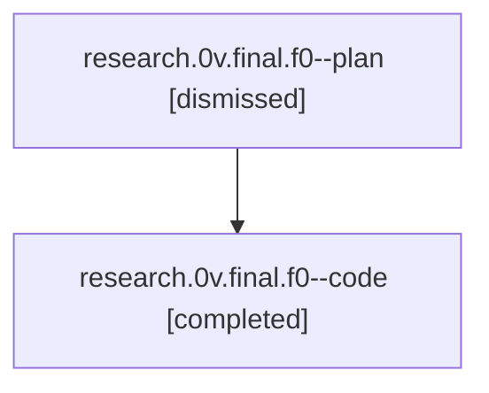

# Family: research.0v.final.f0

[Agent Hoods](../README.md) / [bbugyi200](../users/bbugyi200/README.md) / [athena](../users/bbugyi200/machines/athena/README.md) / [research](../users/bbugyi200/machines/athena/hoods/research/README.md) / research.0v.final.f0

Owner: `bbugyi200.athena` · Hood: `research` · Members: 2

## Lineage

The diagram is an optional enhancement; the ordered table below contains the same lineage in accessible text.

| Role | Agent | State | Model / provider | Timing | Commits | Prompt | Chat |
|---|---|---|---|---|---:|---|---|
| plan | research.0v.final.f0--plan | dismissed | — | 2026-08-21T20:13:51 | 0 | — | — |
| code | research.0v.final.f0--code | completed | grok-4.6 / grok | 2026-08-21T20:28:28.000551+00:00 → 2026-08-21T21:35:56.803219+00:00 | [1](../agents/bbugyi200.athena.research.0v.final.f0--code/README.md#commits) | — | [Chat](../agents/bbugyi200.athena.research.0v.final.f0--code/chat.md) |

## Commits

| Role | Repo | Commit | Subject | Committed |
|---|---|---|---|---|
| code | sase | [`4dde458`](https://github.com/sase-org/sase/commit/4dde458f593687ee4e8fb6734c1dbd1b0fef1215) | fix(file-hooks): record dispatch outcomes and repair missed commit batches | 2026-08-21 17:35:14 EDT |

## Neighbors

| Agent | Relation | State |
|---|---|---|
| [research.0v.final](../agents/bbugyi200.athena.research.0v.final/README.md) | ancestor | dismissed |
| [research.0v.cdx](../agents/bbugyi200.athena.research.0v.cdx/README.md) | research.0v hood | dismissed |
| [research.0v.cld](../agents/bbugyi200.athena.research.0v.cld/README.md) | research.0v hood | dismissed |
| [research.0v.image](../agents/bbugyi200.athena.research.0v.image/README.md) | research.0v hood | dismissed |
| [research.0.cdx](../agents/bbugyi200.athena.research.0.cdx/README.md) | research hood | dismissed |
| [research.0.cld](../agents/bbugyi200.athena.research.0.cld/README.md) | research hood | dismissed |
| [research.0.final](../agents/bbugyi200.athena.research.0.final/README.md) | research hood | dismissed |
| [research.0.image](../agents/bbugyi200.athena.research.0.image/README.md) | research hood | dismissed |
| [research.00.cdx](../agents/bbugyi200.athena.research.00.cdx/README.md) | research hood | active |
| [research.00.cld](../agents/bbugyi200.athena.research.00.cld/README.md) | research hood | active |
| [research.00.final](../agents/bbugyi200.athena.research.00.final/README.md) | research hood | active |
| [research.00.image](../agents/bbugyi200.athena.research.00.image/README.md) | research hood | waiting |
| [research.01.cdx](../agents/bbugyi200.athena.research.01.cdx/README.md) | research hood | active |
| [research.01.cld](../agents/bbugyi200.athena.research.01.cld/README.md) | research hood | active |
| [research.01.final](../agents/bbugyi200.athena.research.01.final/README.md) | research hood | active |
| [research.01.image](../agents/bbugyi200.athena.research.01.image/README.md) | research hood | active |
| [research.02.cdx](../agents/bbugyi200.athena.research.02.cdx/README.md) | research hood | active |
| [research.02.cld](../agents/bbugyi200.athena.research.02.cld/README.md) | research hood | active |
| [research.02.final](../agents/bbugyi200.athena.research.02.final/README.md) | research hood | active |
| [research.02.image](../agents/bbugyi200.athena.research.02.image/README.md) | research hood | active |
| [research.03.cdx](../agents/bbugyi200.athena.research.03.cdx/README.md) | research hood | active |
| [research.03.cld](../agents/bbugyi200.athena.research.03.cld/README.md) | research hood | active |
| [research.03.final](../agents/bbugyi200.athena.research.03.final/README.md) | research hood | active |
| [research.03.image](../agents/bbugyi200.athena.research.03.image/README.md) | research hood | active |
| [research.04.cdx](../agents/bbugyi200.athena.research.04.cdx/README.md) | research hood | active |
| [research.04.cld](../agents/bbugyi200.athena.research.04.cld/README.md) | research hood | active |
| [research.04.final](../agents/bbugyi200.athena.research.04.final/README.md) | research hood | active |
| [research.04.image](../agents/bbugyi200.athena.research.04.image/README.md) | research hood | active |
| [research.05.cdx](../agents/bbugyi200.athena.research.05.cdx/README.md) | research hood | active |
| [research.05.cld](../agents/bbugyi200.athena.research.05.cld/README.md) | research hood | active |
| [research.05.final](../agents/bbugyi200.athena.research.05.final/README.md) | research hood | active |
| [research.05.image](../agents/bbugyi200.athena.research.05.image/README.md) | research hood | active |
| [research.06.cdx](../agents/bbugyi200.athena.research.06.cdx/README.md) | research hood | active |
| [research.06.cld](../agents/bbugyi200.athena.research.06.cld/README.md) | research hood | active |
| [research.06.final](../agents/bbugyi200.athena.research.06.final/README.md) | research hood | active |
| [research.06.image](../agents/bbugyi200.athena.research.06.image/README.md) | research hood | active |
| [research.07.cdx](../agents/bbugyi200.athena.research.07.cdx/README.md) | research hood | active |
| [research.07.cld](../agents/bbugyi200.athena.research.07.cld/README.md) | research hood | completed |
| [research.07.final](../agents/bbugyi200.athena.research.07.final/README.md) | research hood | completed |
| [research.07.final.f1](../agents/bbugyi200.athena.research.07.final.f1/README.md) | research hood | completed |
| [research.07.image](../agents/bbugyi200.athena.research.07.image/README.md) | research hood | completed |
| [research.08.cdx](../agents/bbugyi200.athena.research.08.cdx/README.md) | research hood | active |
| [research.08.cld](../agents/bbugyi200.athena.research.08.cld/README.md) | research hood | waiting |
| [research.08.final](../agents/bbugyi200.athena.research.08.final/README.md) | research hood | completed |
| [research.08.image](../agents/bbugyi200.athena.research.08.image/README.md) | research hood | completed |
| [research.09.cdx](../agents/bbugyi200.athena.research.09.cdx/README.md) | research hood | active |
| [research.09.cld](../agents/bbugyi200.athena.research.09.cld/README.md) | research hood | active |
| [research.09.final](../agents/bbugyi200.athena.research.09.final/README.md) | research hood | active |
| [research.09.image](../agents/bbugyi200.athena.research.09.image/README.md) | research hood | active |
| [research.0a.cdx](../agents/bbugyi200.athena.research.0a.cdx/README.md) | research hood | active |
| [research.0a.cld](../agents/bbugyi200.athena.research.0a.cld/README.md) | research hood | active |
| [research.0a.final](../agents/bbugyi200.athena.research.0a.final/README.md) | research hood | active |
| [research.0a.final.f1](../agents/bbugyi200.athena.research.0a.final.f1/README.md) | research hood | completed |
| [research.0a.image](../agents/bbugyi200.athena.research.0a.image/README.md) | research hood | active |
| … and 296 more in the [hood roster](../users/bbugyi200/machines/athena/hoods/research/README.md) | research hood | — |
