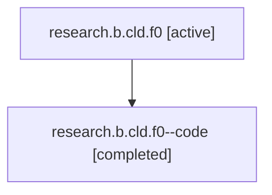

# Family: research.b.cld.f0

Owner: `bbugyi200.athena` · Hood: `research` · Members: 2

## Lineage

The diagram is an optional enhancement; the ordered table below contains the same lineage in accessible text.

| Role | Agent | State | Model / provider | Timing | Commits | Prompt | Chat |
|---|---|---|---|---|---:|---|---|
| root | research.b.cld.f0 | active | claude-fable-5 / claude | 2026-07-14T11:31:47.972371+00:00 | 1 | [Prompt](../agents/bbugyi200.athena.research.b.cld.f0/prompt.md) | [Chat](../agents/bbugyi200.athena.research.b.cld.f0/chat.md) |
| code | research.b.cld.f0--code | completed | gpt-5.6-sol / codex | 2026-07-14T11:38:57.812876+00:00 | 1 | — | [Chat](../agents/bbugyi200.athena.research.b.cld.f0--code/chat.md) |
