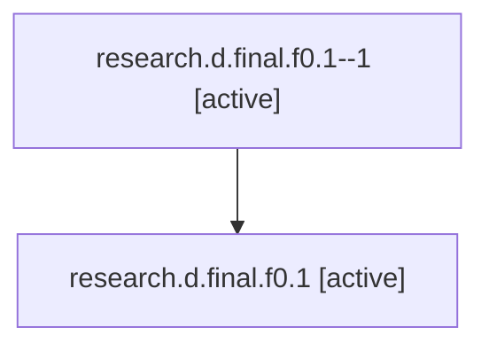

# Family: research.d.final.f0.1

Owner: `bbugyi200.athena` · Hood: `research` · Members: 2

## Lineage

The diagram is an optional enhancement; the ordered table below contains the same lineage in accessible text.

| Role | Agent | State | Model / provider | Timing | Commits | Prompt | Chat |
|---|---|---|---|---|---:|---|---|
| 1 | research.d.final.f0.1--1 | active | gpt-5.6-sol / codex | 2026-07-16T18:27:49.602464+00:00 | 0 | — | — |
| root | research.d.final.f0.1 | active | gpt-5.6-sol / codex | 2026-07-16T18:17:47.414687+00:00 | 0 | [Prompt](../agents/bbugyi200.athena.research.d.final.f0.1/prompt.md) | [Chat](../agents/bbugyi200.athena.research.d.final.f0.1/chat.md) |
