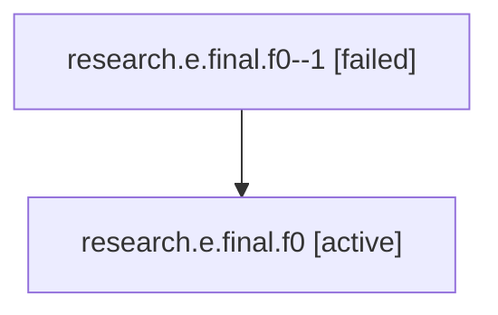

# Family: research.e.final.f0

Owner: `bbugyi200.athena` · Hood: `research` · Members: 2

## Lineage

The diagram is an optional enhancement; the ordered table below contains the same lineage in accessible text.

| Role | Agent | State | Model / provider | Timing | Commits | Prompt | Chat |
|---|---|---|---|---|---:|---|---|
| 1 | research.e.final.f0--1 | failed | gpt-5.6-sol / codex | 2026-07-16T18:54:32.692362+00:00 | 0 | — | [Chat](../agents/bbugyi200.athena.research.e.final.f0--1/chat.md) |
| root | research.e.final.f0 | active | gpt-5.6-sol / codex | 2026-07-16T18:36:11.929754+00:00 | 0 | [Prompt](../agents/bbugyi200.athena.research.e.final.f0/prompt.md) | [Chat](../agents/bbugyi200.athena.research.e.final.f0/chat.md) |
