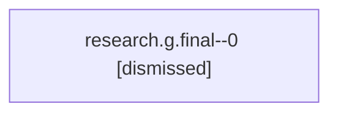

# Family: research.g.final

Owner: `bbugyi200.athena` · Hood: `research` · Members: 1

## Lineage

The diagram is an optional enhancement; the ordered table below contains the same lineage in accessible text.

| Role | Agent | State | Model / provider | Timing | Commits | Prompt | Chat |
|---|---|---|---|---|---:|---|---|
| 0 | research.g.final--0 | dismissed | claude-fable-5 / claude | 2026-07-17T10:01:39.546990 → 2026-07-17T10:07:58.290201 | 0 | — | [Chat](../agents/bbugyi200.athena.research.g.final--0/chat.md) |
