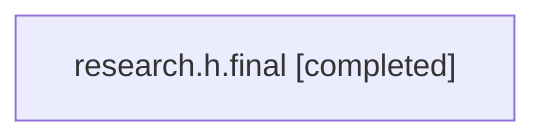

# Family: research.h.final

Owner: `bbugyi200.athena` · Hood: `research` · Members: 1

## Lineage

The diagram is an optional enhancement; the ordered table below contains the same lineage in accessible text.

| Role | Agent | State | Model / provider | Timing | Commits | Prompt | Chat |
|---|---|---|---|---|---:|---|---|
| root | research.h.final | completed | claude-fable-5 / claude | 2026-07-17T17:29:58.960586+00:00 | 0 | [Prompt](../agents/bbugyi200.athena.research.h.final/prompt.md) | [Chat](../agents/bbugyi200.athena.research.h.final/chat.md) |
