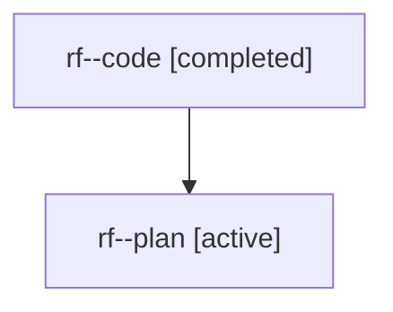

# Family: rf

[Agent Hoods](../README.md) / [bbugyi200](../users/bbugyi200/README.md) / [athena](../users/bbugyi200/machines/athena/README.md) / [rf](../users/bbugyi200/machines/athena/hoods/rf/README.md) / rf

Owner: `bbugyi200.athena` · Hood: `rf` · Members: 2

## Lineage

The diagram is an optional enhancement; the ordered table below contains the same lineage in accessible text.

| Role | Agent | State | Model / provider | Timing | Commits | Prompt | Chat |
|---|---|---|---|---|---:|---|---|
| code | rf--code | completed | gpt-5.5 / codex | 2026-08-01T14:30:09.187476+00:00 | [1](../agents/bbugyi200.athena.rf--code/README.md#commits) | — | [Chat](../agents/bbugyi200.athena.rf--code/chat.md) |
| plan | rf--plan | active | gpt-5.6-sol / codex | 2026-08-01T14:20:58.049890+00:00 | 0 | [Prompt](../agents/bbugyi200.athena.rf--plan/prompt.md) | [Chat](../agents/bbugyi200.athena.rf--plan/chat.md) |

## Commits

| Role | Repo | Commit | Subject | Committed |
|---|---|---|---|---|
| code | sase | [`cd12442`](https://github.com/sase-org/sase/commit/cd124420f4115892a1f569a7ba19df7abefe26a1) | feat(tui): show bead notes in agent headers | 2026-08-01 11:18:18 EDT |
